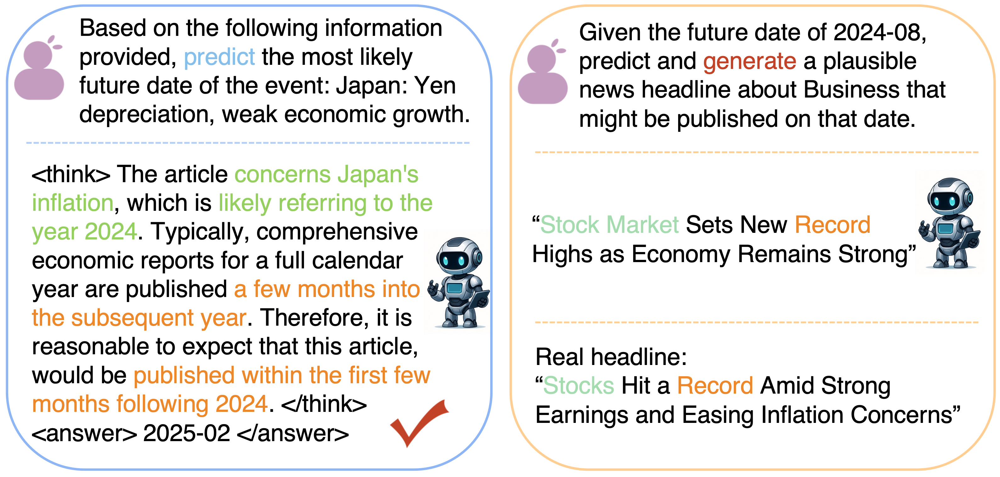
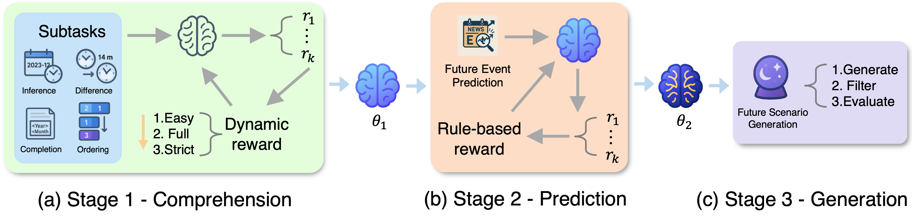
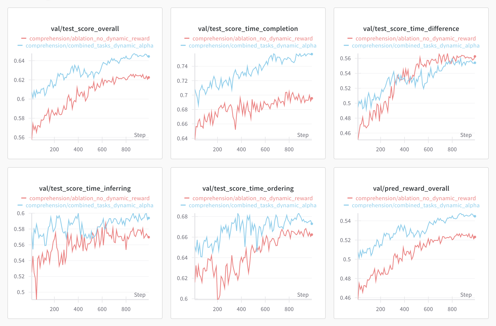
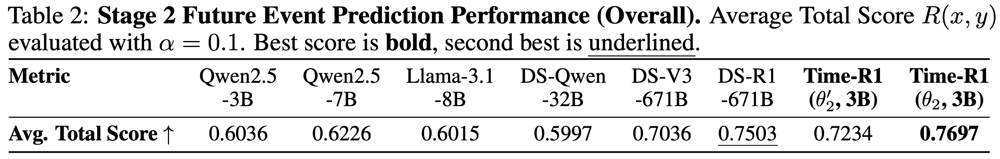
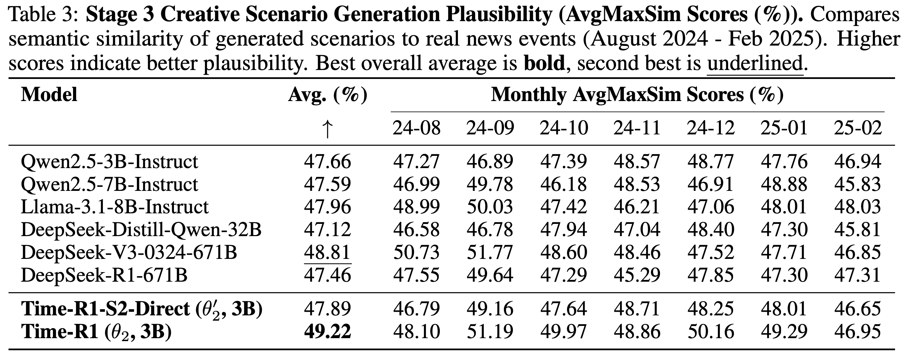

<div align="center">
<h1>
Time-R1: Towards Comprehensive Temporal Reasoning in LLMs
</h1>
</div>

**Time-R1 is a framework designed to endow Language Models (LLMs) with comprehensive temporal reasoning capabilities, enabling them to progressively cultivate sophisticated temporal logic from past events, predict future occurrences, and creatively generate plausible future scenarios.**

This repository contains the official code, the Time-Bench dataset, and pre-trained model checkpoints for our [paper](https://arxiv.org/abs/2505.13508):
> **Time-R1: Towards Comprehensive Temporal Reasoning in LLMs** > Zijia Liu, Peixuan Han, Haofei Yu, Haoru Li, Jiaxuan You  

<div align="center">

<!--  -->

<br/><em>Figure: Time-R1 output examples: Event Prediction (Stage 2, Left) & Future Scenario Generation (Stage 3, Right).</em>
</div>

## 🌟 Overview

<div align="center">


</div>

Large Language Models (LLMs) demonstrate impressive capabilities but often lack robust temporal intelligence. Time-R1 addresses this by introducing a novel **three-stage reinforcement learning (RL) curriculum** driven by a meticulously designed **dynamic rule-based reward system**. Our approach progressively builds:
1.  **(Stage 1: Comprehension)** Foundational temporal understanding and logical event-time mappings from historical data.
2.  **(Stage 2: Prediction)** Skills to predict future event times, especially for events beyond the model's knowledge cutoff, using synthetic data to ensure rigorous training and prevent information leakage.
3.  **(Stage 3: Generation)** Strong generalization to creatively generate plausible future scenarios *without direct fine-tuning* for this task, leveraging capabilities from the first two stages.

Our experiments show that a 3B-parameter Time-R1 model significantly outperforms models over 200 times its size on challenging future event prediction and creative scenario generation benchmarks.


## 📚 Released Resources

* **Time-Bench Dataset:** [Coming soon]
    * Contains over 200,000 examples with explicit temporal annotations.
    * Covers diverse tasks: timestamp inference, time-gap estimation, event ordering, and masked time entity completion.
    * Further details on dataset construction can be found in Appendix [X] of our paper and [link to your dataset appendix/documentation if separate].
    * The training scripts expect the dataset files (e.g., `.parquet` files) to be placed in a `datasets` subdirectory within the `OUTPUT_BASE_DIR` specified in the scripts (e.g., `Time-R1/datasets/`).
* **Time-R1 Model Checkpoints:** [Coming soon]
    * Includes checkpoints for $\theta_1$ (after Stage 1) and $\theta_2$ (after Stage 2).
* **Source Code:** For training Time-R1 and evaluating on Time-Bench.


## 🚀 Key Features

*   **Comprehensive Temporal Reasoning:** Unified capabilities for understanding, prediction, and creative generation related to time.
*   **Novel 3-Stage RL Curriculum:** Progressively builds temporal skills from foundational understanding to advanced future-oriented reasoning.
*   **Dynamic Reward System:** Meticulously designed rewards guide the LLM effectively. (See details below)
*   **State-of-the-Art Performance:** Our 3B Time-R1 model surpasses significantly larger models on key temporal tasks.
*   **Time-Bench Dataset:** A new large-scale, multi-task temporal reasoning dataset derived from ten years of news data.
*   **Staged Model Checkpoints:** The training process yields distinct model checkpoints ($\theta_1$ and $\theta_2$) representing different stages of temporal reasoning capability, which can be reproduced using the provided scripts.


## 🧠 Dynamic Reward System

A core component of Time-R1 is its dynamic rule-based reward system. This system is crucial for guiding the LLM through the complexities of temporal reasoning. The detailed implementation of our reward functions can be found in the following files:
*   `Time-R1/verl/utils/reward_score/time_reasoning.py` (over 1200 lines of code dedicated to various temporal comprehension reward calculations)
*   `Time-R1/verl/utils/reward_score/time_prediction.py` (handles rewards for future time prediction tasks)

These modules implement nuanced scoring for different temporal aspects, adapting to the learning stage and task difficulty.


## 📂 Core Logic
*   **RL Workflow:** Refer to `verl/trainer/main_ppo*.py` (e.g., `main_ppo_s1_p1.py`, `main_ppo_s2.py`) and `verl/trainer/ppo/ray_trainer.py`.
*   **Reward Design:** As detailed above, see `verl/utils/reward_score/`.
*   **Hyperparameters:** General PPO hyperparameters can be found in `verl/trainer/config/ppo_trainer.yaml`, with task-specific overrides in the training scripts.

---

## 🛠️ Setup

1.  **Create Conda Environment (Recommended):**
    ```bash
    # python=3.9 is recommended as per the verl framework.
    conda create -n timer1 python=3.9 
    conda activate timer1
    ```

2.  **Install Dependencies:**
    ```bash
    # Install PyTorch (or you can skip this step and let vLLM install the correct version for you)
    pip install torch==2.4.0 --index-url https://download.pytorch.org/whl/cu121

    # Install vLLM and Ray
    # Note: vllm==0.6.3 is specified, other versions like 0.5.4, 0.4.2, 0.3.1 might also work.
    pip3 install vllm==0.6.3 
    pip3 install ray

    # Install the verl framework (local editable install)
    pip install -e .

    # Install Flash Attention 2
    pip3 install flash-attn --no-build-isolation

    # Install other useful packages (e.g., for logging and plotting)
    pip install wandb IPython matplotlib

    # Install remaining dependencies from requirements.txt if any are not covered above
    pip install -r requirements.txt 
    ```

3.  **Environment Configuration:**
    Ensure that system variables (like `CUDA_VISIBLE_DEVICES`, `WANDB_ENTITY` if using Weights & Biases, and paths to `BASE_MODEL` or `OUTPUT_BASE_DIR`) are correctly configured in your environment or within the bash scripts before execution. These are often marked with "###" in the scripts and require user-specific values.


## ⚙️ Training Time-R1

The Time-R1 model is trained progressively through a series of stages and phases.

### Stage 1: Temporal Comprehension (Yields $\theta_1$)
This stage focuses on building foundational temporal understanding. It is divided into three phases, each building upon the previous:
1.  **Phase 1 (Inference Easy):** Trains on simpler temporal inference tasks.
    *   Script: `scripts/stage1_phase1.sh`
2.  **Phase 2 (All Comprehension Tasks, Different Alphas):** Introduces all comprehension tasks with varied difficulty (alpha values for reward calculation).
    *   Script: `scripts/stage1_phase2.sh`
    *   This phase uses the checkpoint from Phase 1 as its `BASE_MODEL`.
3.  **Phase 3 (All Comprehension Tasks, Dynamic Alpha):** Fine-tunes with a dynamic alpha in the reward system, further enhancing nuanced understanding. This phase yields the final $\theta_1$ checkpoint.
    *   Script: `scripts/stage1_phase3.sh`
    *   This phase uses the checkpoint from Phase 2 as its `BASE_MODEL`.

### Stage 2: Future Event Time Prediction (Yields $\theta_2$)
This stage trains the model to predict future event times, using the $\theta_1$ checkpoint as a starting point.
*   Script: `scripts/stage2.sh`
*   This stage uses the $\theta_1$ checkpoint (from Stage 1, Phase 3) as its `BASE_MODEL`.


## 🔬 Validation (Stage 3 Capability)

While Stage 3 (Creative Future Scenario Generation) does not involve direct fine-tuning, its capabilities are an emergent property of the model trained through Stages 1 and 2 (i.e., the $\theta_2$ checkpoint). We validate this capability by generating future news.
*   Script: `future_news_generation/stage3.sh`
*   This script uses the $\theta_2$ checkpoint for news generation and then runs analysis scripts on the generated content.

---

## 📈 Results

### Stage 1: Temporal Comprehension ($\theta_1$)
Through careful reward design and a phased training curriculum, our Stage 1 results have shown significant improvements, particularly in tasks like time-difference estimation, substantially surpassing the results reported in the main paper. The overall average performance of our $\theta_1$ model (after the 3-phase training) now exceeds that of models over 200 times its size, such as DeepSeek-V3-0324-671B.

The impact of our dynamic reward mechanism is illustrated below. The blue curve represents the training progression of $\theta_1$ using our full 3-phase dynamic reward design, while the red curve shows an ablation study where the dynamic reward components are omitted (trained using `scripts/stage1_no_dynamic_reward.sh`).

<div align="center">



*Figure: Training curves for Stage 1. Blue: Time-R1 with 3-phase dynamic rewards. Red: Ablation without dynamic reward design.*
</div>

### Stage 2 & 3: Future Prediction and Generation ($\theta_2$)
The $\theta_2$ model, after being trained in Stage 2, demonstrates strong capabilities in both future event time prediction and creative future scenario generation (Stage 3 validation). Our results indicate that Time-R1 ($\theta_2$) surpasses specialized state-of-the-art reasoning models like DeepSeek-R1, which are also more than 200 times larger.

<div align="center">

<!-- 
 -->


  

*Figure: Performance comparison for future prediction (Stage 2) and creative generation (Stage 3).*
</div>

---
For detailed hyperparameters and further experimental setup, please refer to the main paper and the provided scripts.
