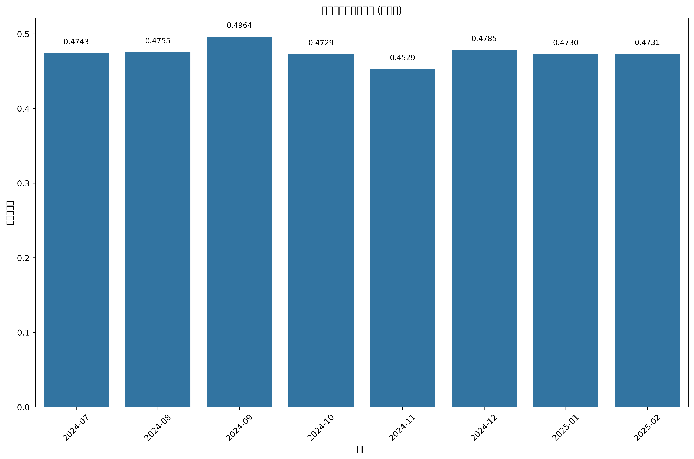

# 生成新闻与真实新闻相似度月度分析报告

## 月度相似度汇总

| 月份 | 生成新闻数量 | 真实新闻数量 | 平均相似度 |
|------|------------|--------------|----------|
| 2024-07 | 40 | 2283 | 0.4743 |
| 2024-08 | 40 | 2092 | 0.4755 |
| 2024-09 | 40 | 2148 | 0.4964 |
| 2024-10 | 40 | 2262 | 0.4729 |
| 2024-11 | 40 | 2021 | 0.4529 |
| 2024-12 | 40 | 1855 | 0.4785 |
| 2025-01 | 40 | 2329 | 0.4730 |
| 2025-02 | 40 | 2034 | 0.4731 |

## 月度相似度分析

## 各月份详细结果

- [2024-07 月份分析结果](similarity_2024-07/top_similar_news.md)
- [2024-08 月份分析结果](similarity_2024-08/top_similar_news.md)
- [2024-09 月份分析结果](similarity_2024-09/top_similar_news.md)
- [2024-10 月份分析结果](similarity_2024-10/top_similar_news.md)
- [2024-11 月份分析结果](similarity_2024-11/top_similar_news.md)
- [2024-12 月份分析结果](similarity_2024-12/top_similar_news.md)
- [2025-01 月份分析结果](similarity_2025-01/top_similar_news.md)
- [2025-02 月份分析结果](similarity_2025-02/top_similar_news.md)

## 数据说明

本分析比较了 deepseek r1 模型生成的未来新闻与真实新闻数据集的相似度。相似度反映了生成内容与真实新闻在主题和风格上的接近程度，帮助评估模型生成的新闻在内容上的真实性。